# Complete Medify System - Use Case Diagram

## Mermaid Diagram Code

```mermaid
graph TB
    subgraph System["🏥 Medify Platform"]
        subgraph HospitalFeatures["Hospital Admin Management"]
            H1["UC-H1: Register/Login<br/>✅ Implemented"]
            H2["UC-H2: Manage Hospital Profile<br/>✅ Implemented"]
            H3["UC-H3: Manage Departments<br/>✅ Implemented"]
            H4["UC-H4: Manage Doctors<br/>✅ Implemented"]
            H5["UC-H5: Define Doctor Schedules<br/>✅ Implemented"]
            H6["UC-H6: Compose Pages/Blocks<br/>✅ Implemented"]
            H7["UC-H7: Publish/Unpublish Website<br/>✅ Implemented"]
            H8["UC-H8: View Booked Appointments<br/>✅ Implemented"]
        end
        
        subgraph HospitalAnalytics["Hospital Analytics & Admin"]
            HA1["UC-HA1: View Analytics Dashboard<br/>📊 Missing"]
            HA2["UC-HA2: Generate Booking Reports<br/>📊 Missing"]
            HA3["UC-HA3: View Doctor Utilization<br/>📊 Missing"]
            HNOT["UC-HNOT1: Configure Notifications<br/>📧 Missing"]
        end
        
        subgraph PharmacyFeatures["Pharmacy Manager Operations"]
            PH1["UC-PH1: Manage Business Info<br/>✅ Implemented"]
            PH2["UC-PH2: Product CRUD & CSV Upload<br/>✅ Implemented"]
            PH3["UC-PH3: Publish Pharmacy Site<br/>✅ Implemented"]
            PH4["UC-PH4: View Product Analytics<br/>⚠️ Partial"]
        end
        
        subgraph PharmacyAdvanced["Pharmacy Advanced Features"]
            POM["UC-POM1: Manage Orders<br/>📦 Missing"]
            PINV["UC-PINV1: Manage Inventory<br/>📦 Missing"]
            PPAY["UC-PPAY1: Process Payments<br/>💳 Missing"]
            PRPT["UC-PRPT1: Generate Sales Reports<br/>📊 Missing"]
            PNOT["UC-PNOT1: Send Order Notifications<br/>📧 Missing"]
        end
        
        subgraph GuestFeatures["Guest Patient/Public Website"]
            G1["UC-P1: Browse Hospital Website<br/>✅ Implemented"]
            G2["UC-P2: Select Doctor & Book<br/>✅ Implemented"]
            G3["UC-P3: Query AI Assistant<br/>✅ Implemented"]
        end
        
        subgraph GuestAdvanced["Guest Advanced Features"]
            GFB["UC-GFDB1: Submit Feedback/Ratings<br/>⭐ Missing"]
            GNOT["UC-GNOT1: Receive Notifications<br/>📧 Missing"]
            GSRC["UC-GSRC1: Advanced Search/Filter<br/>🔍 Missing"]
            GORD["UC-GORD1: Track Order Status<br/>📦 Missing"]
        end
        
        subgraph Shared["Shared Features"]
            LOGIN["UC-AUTH1: User Authentication<br/>✅ Implemented"]
            PAY["UC-PAY1: Payment Processing<br/>💳 Missing"]
            THEME["UC-THEME1: Customize Theme<br/>🎨 Missing"]
            ROLE["UC-ROLE1: Manage User Roles<br/>👥 Missing"]
            IMG["UC-IMG1: Media/Image Management<br/>🖼️ Missing"]
        end
    end
    
    %% Actors
    HospitalAdmin["👨‍⚕️ Hospital Admin"]
    PharmacyManager["💊 Pharmacy Manager"]
    GuestPatient["👤 Guest Patient"]
    AppointmentReminder["📋 Appointment Reminder<br/>Service"]
    PaymentGateway["💳 Payment Gateway<br/>Stripe/Fawry"]
    EmailService["📧 Email Service"]
    
    %% Hospital Admin Relationships
    HospitalAdmin -->|registers/logs in| H1
    HospitalAdmin -->|manages profile| H2
    HospitalAdmin -->|manages departments| H3
    HospitalAdmin -->|manages doctors| H4
    HospitalAdmin -->|defines schedules| H5
    HospitalAdmin -->|composes pages| H6
    HospitalAdmin -->|publishes site| H7
    HospitalAdmin -->|views appointments| H8
    HospitalAdmin -->|views analytics| HA1
    HospitalAdmin -->|generates reports| HA2
    HospitalAdmin -->|checks utilization| HA3
    HospitalAdmin -->|configures alerts| HNOT
    HospitalAdmin -->|customizes theme| THEME
    HospitalAdmin -->|manages team roles| ROLE
    
    %% Pharmacy Manager Relationships
    PharmacyManager -->|registers/logs in| H1
    PharmacyManager -->|manages info| PH1
    PharmacyManager -->|manages products| PH2
    PharmacyManager -->|publishes site| PH3
    PharmacyManager -->|views analytics| PH4
    PharmacyManager -->|manages orders| POM
    PharmacyManager -->|tracks inventory| PINV
    PharmacyManager -->|processes payments| PPAY
    PharmacyManager -->|generates reports| PRPT
    PharmacyManager -->|sends notifications| PNOT
    PharmacyManager -->|customizes theme| THEME
    PharmacyManager -->|manages team roles| ROLE
    
    %% Guest Patient Relationships
    GuestPatient -->|browses| G1
    GuestPatient -->|books appointments| G2
    GuestPatient -->|uses AI| G3
    GuestPatient -->|provides feedback| GFB
    GuestPatient -->|receives notifications| GNOT
    GuestPatient -->|searches/filters| GSRC
    GuestPatient -->|tracks orders| GORD
    GuestPatient -->|makes payment| PAY
    
    %% Service Integrations
    H8 -.->|triggers| AppointmentReminder
    G2 -.->|triggers| AppointmentReminder
    PPAY -.->|communicates| PaymentGateway
    PAY -.->|communicates| PaymentGateway
    GNOT -.->|uses| EmailService
    PNOT -.->|uses| EmailService
    HNOT -.->|uses| EmailService
    
    %% Include/Extend relationships
    H2 -.->|includes| IMG
    PH2 -.->|includes| IMG
    G1 -.->|includes| IMG
    
    %% Data Flow
    G2 -.->|creates| H8
    POM -.->|updates| PINV
    PPAY -.->|records| PRPT
    
    %% Styling
    classDef implemented fill:#90EE90,stroke:#228B22,stroke-width:2px,color:#000
    classDef partial fill:#FFD700,stroke:#FFA500,stroke-width:2px,color:#000
    classDef missing fill:#FFB6C6,stroke:#DC143C,stroke-width:2px,color:#000
    classDef actor fill:#87CEEB,stroke:#4169E1,stroke-width:2px,color:#000
    classDef service fill:#DDA0DD,stroke:#8B008B,stroke-width:2px,color:#000
    classDef shared fill:#F0E68C,stroke:#DAA520,stroke-width:2px,color:#000
    
    class H1,H2,H3,H4,H5,H6,H7,H8,PH1,PH2,PH3,G1,G2,G3,LOGIN implemented
    class PH4 partial
    class HA1,HA2,HA3,HNOT,POM,PINV,PPAY,PRPT,PNOT,GFB,GNOT,GSRC,GORD,PAY,THEME,ROLE,IMG,AppointmentReminder,PaymentGateway,EmailService missing
    class HospitalAdmin,PharmacyManager,GuestPatient actor
    class AppointmentReminder,PaymentGateway,EmailService service
    class LOGIN,PAY,THEME,ROLE,IMG shared
```

---

## Complete System Overview

### **ACTORS**
1. **Hospital Admin** - Manages hospital profile, doctors, departments, schedules, appointments
2. **Pharmacy Manager** - Manages pharmacy products, orders, inventory
3. **Guest Patient** - Browses websites, books appointments, makes orders
4. **External Services** - Appointment Reminder Service, Payment Gateway, Email Service

---

### **USE CASES BY CATEGORY**

#### **✅ FULLY IMPLEMENTED (14)**
- UC-H1: Register/Login
- UC-H2: Manage Hospital Profile
- UC-H3: Manage Departments
- UC-H4: Manage Doctors
- UC-H5: Define Doctor Schedules
- UC-H6: Compose Pages/Blocks
- UC-H7: Publish/Unpublish Website
- UC-H8: View Booked Appointments
- UC-PH1: Manage Business Info
- UC-PH2: Product CRUD & CSV Upload
- UC-PH3: Publish Pharmacy Site
- UC-P1: Browse Hospital Website
- UC-P2: Select Doctor & Book Appointment
- UC-P3: Query AI Assistant

#### **⚠️ PARTIALLY IMPLEMENTED (1)**
- UC-PH4: View Product Analytics (model exists, no endpoints)

#### **📊 MISSING - Analytics & Reporting (4)**
- UC-HA1: View Analytics Dashboard
- UC-HA2: Generate Booking Reports
- UC-HA3: View Doctor Utilization
- UC-PRPT1: Generate Sales Reports

#### **📦 MISSING - Order & Inventory Management (3)**
- UC-POM1: Manage Orders
- UC-PINV1: Manage Inventory
- UC-GORD1: Track Order Status

#### **📧 MISSING - Notifications (4)**
- UC-HNOT1: Configure Notifications
- UC-PNOT1: Send Order Notifications
- UC-GNOT1: Receive Notifications
- UC-Appointment Reminder Service

#### **💳 MISSING - Payment Processing (2)**
- UC-PPAY1: Process Payments (Pharmacy)
- UC-PAY1: Payment Processing (Guest)

#### **⭐ MISSING - Feedback & Reviews (1)**
- UC-GFDB1: Submit Feedback/Ratings

#### **🔍 MISSING - Search & Discovery (1)**
- UC-GSRC1: Advanced Search/Filter

#### **🎨 MISSING - Customization (1)**
- UC-THEME1: Customize Theme

#### **👥 MISSING - User Management (1)**
- UC-ROLE1: Manage User Roles/Permissions

#### **🖼️ MISSING - Media Management (1)**
- UC-IMG1: Media/Image Management

---

## **RELATIONSHIPS & INTERACTIONS**

### **Primary Relationships**
- Hospital Admin uses all hospital management UCs
- Pharmacy Manager uses all pharmacy management UCs
- Guest Patient uses all public website UCs
- Shared Auth UC available to all actors

### **Data Flow Relationships**
- Guest Patient booking (`UC-P2`) → creates Hospital Admin appointment view (`UC-H8`)
- Pharmacy Orders (`UC-POM1`) → updates Inventory (`UC-PINV1`)
- Payment Processing (`UC-PPAY1`) → records in Sales Reports (`UC-PRPT1`)

### **Service Integration Relationships**
- Appointments trigger Reminder Service
- Notifications require Email Service
- Payments communicate with Payment Gateway
- Media uploads handled by Image Management

---

## **LEGEND**
- 🟢 **✅ Implemented** - Feature is production-ready
- 🟡 **⚠️ Partial** - Feature exists but incomplete
- 🔴 **📊/📦/📧/💳/⭐/🔍/🎨/👥/🖼️ Missing** - Feature not yet implemented

---

## **TOTAL STATISTICS**

| Category | Count | Percentage |
|----------|-------|-----------|
| Fully Implemented | 14 | 48% |
| Partially Implemented | 1 | 3% |
| Missing | 14 | 48% |
| **TOTAL USE CASES** | **29** | **100%** |

---

## **IMPLEMENTATION PRIORITY**

### **Phase 2 (High Priority)**
1. Notifications System (4 UCs)
2. Analytics Dashboard (4 UCs)
3. Payment Integration (2 UCs)

### **Phase 3 (Medium Priority)**
1. Order Management (3 UCs)
2. Inventory Management
3. Advanced Search

### **Phase 4 (Low Priority)**
1. Theme Customization
2. User Roles/Permissions
3. Feedback/Ratings System
4. Media Management UI

