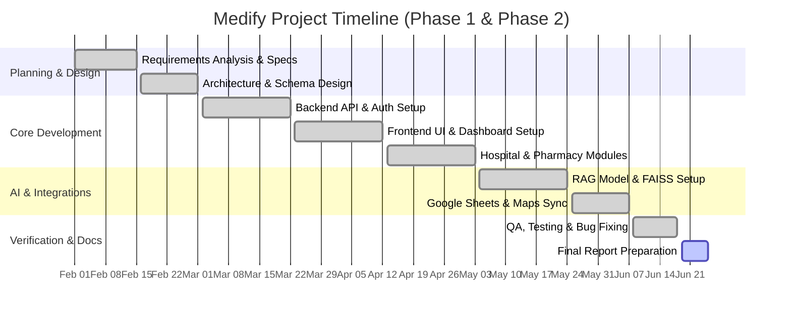

# Chapter 1: Introduction

## 1.1 Background and Motivation

The rapid digitalization of the healthcare sector has transformed how medical services are delivered and accessed. In the modern healthcare landscape, a professional online presence is no longer optional; it is a critical channel for patient acquisition, operational efficiency, and community trust. However, small to medium-sized healthcare providers—such as private clinics, community hospitals, and local pharmacies—face significant challenges when attempting to establish a digital presence.

Developing custom websites requires substantial financial investment, specialized technical knowledge, and continuous maintenance. While large hospital networks can afford dedicated IT departments and bespoke development teams, smaller facilities are often priced out of the market. Conversely, general-purpose website builders (such as Wix or Squarespace) are affordable but lack the critical healthcare-specific features needed to run a medical facility, such as structured doctor rosters, conflict-free appointment booking, department showcases, and pharmacy product catalog workflows.

Medify was conceived to address this market gap. By developing a specialized Software-as-a-Service (SaaS) medical website builder, Medify allows healthcare providers to deploy professional, feature-rich, and search-optimized websites in minutes without writing code. This project is motivated by the desire to democratize access to high-quality digital health interfaces, allowing small providers to compete effectively in a digital-first world while improving accessibility for patients.

## 1.2 Problem Definition

The current processes and technologies available to small-scale medical providers present several key challenges:

1. **High Barriers to Custom Web Development**: Creating a custom website with patient-interactive features typically requires hiring development agencies, leading to high upfront costs and long development cycles.
2. **Inadequacy of General-Purpose Website Builders**: Existing no-code platforms do not support medical workflows. A clinic cannot easily manage doctor availability schedules, and a pharmacy cannot easily synchronize inventory databases or provide specialized search mechanisms.
3. **Manual Scheduling Overload**: Many small clinics still rely on phone calls and manual logs for appointments. This results in high administrative overhead, appointment scheduling conflicts, and increased no-show rates due to the absence of automated confirmation systems.
4. **Isolated Pharmacy Inventories**: Local community pharmacies often operate in isolation from the web, losing customers to large corporate pharmacy chains that offer online catalog search and home delivery services. Local pharmacies lack simple platforms to upload inventory catalogs and keep them updated.
5. **Patient Inquiry Friction**: Patients frequently call medical facilities to ask basic questions about services, hours, or medication availability, placing a heavy burden on front-desk staff during peak operational hours.

## 1.3 Objectives and Proposed Solution

### Objectives

The primary objectives of the Medify project are:
* **Democratize Healthcare Digitalization**: Create an affordable, easy-to-use SaaS platform specifically tailored for medical facilities.
* **Streamline Operations**: Automate patient booking and doctor scheduling to reduce administrative load and eliminate appointment conflicts.
* **Support Dual Workflows**: Provide distinct modules for hospitals (feature-driven site setup with booking) and pharmacies (template-driven catalogs).
* **Leverage Artificial Intelligence**: Incorporate a Retrieval-Augmented Generation (RAG) medical chatbot to assist patients with common facility and medication queries 24/7.
* **Deliver Premium Aesthetics**: Ensure that all generated websites are modern, mobile-responsive, and optimized for patient experience.

### Proposed Solution

Medify is a multi-tenant web application featuring a Next.js 16 frontend and a Django REST API backend. The system provides two main registration paths:

* **Hospital/Clinic Path**: Administrators configure their hospital profile, define medical departments, build a roster of doctors, and set up doctor availability shifts. The platform automatically generates a public-facing website containing an interactive scheduling engine, allowing patients to book conflict-free appointments in real time.
* **Pharmacy Path**: Pharmacy owners can choose from six professionally designed templates. They can manage their catalog by importing products in bulk via CSV files or synchronizing with Google Sheets. The public-facing site acts as an online product catalog.
* **AI Medical Chatbot**: Both hospital and pharmacy sites incorporate an AI assistant. Built using RAG architecture, it queries custom vector databases to answer patient questions about the facility, doctor schedules, or medication details while adhering to predefined safety disclaimers.

## 1.4 Scope and Limitations

### Project Scope

The project implementation focuses on the following core components:
* **Multi-Tenant Routing**: Dynamically rewriting subdomains (e.g., `clinic.localhost:3000`) to direct visitors to the corresponding tenant's public website.
* **User Authentication**: Secure JWT-based registration, login, token refresh, password reset, and account deletion flows for administrators.
* **Hospital CRM & Booking**: Complete backend and frontend modules for managing departments, doctors, scheduling slots, and booking appointments with real-time validation.
* **Pharmacy Management**: Product catalog CRUD operations, bulk CSV file importer, and Google Sheets integration.
* **Template Customization**: Six customizable frontend layouts for pharmacy tenants.
* **AI-RAG Integration**: Medical assistant using Hugging Face sentence-transformers, FAISS vector index, and Gemini API to process natural language inquiries.

### Project Limitations

The current phase of the project has the following limitations:
* **Payment Processing**: Payment models (Visa and Fawry) are implemented on the frontend UI, but full backend transaction processing is out-of-scope for this phase.
* **Third-Party Clinical Integrations**: The system does not integrate directly with Electronic Medical Record (EMR) or Electronic Health Record (EHR) enterprise databases.
* **Telehealth Services**: Live video consultation hosting and remote patient monitoring are not included.
* **Language Support**: The public website and builder interfaces are currently restricted to English (bilingual localization is planned for future phases).

## 1.5 Development Methodology

To ensure rapid development, flexibility, and high-quality software output, the Medify project follows the **Agile Scrum Methodology**. This framework is chosen to accommodate changes in requirements, encourage iterative implementation, and maintain a clear separation of development concerns.

The development cycle is organized into two-week sprints:
1. **Requirements Analysis**: Collaboratively defining backlog user stories for tenant onboarding, scheduling, and AI features.
2. **Sprint Planning**: Assigning tasks to core backend API development, frontend component composition, or AI model training/indexing.
3. **Daily Progress Checks**: Monitoring integration points, particularly JWT verification and subdomain redirection.
4. **Sprint Review & Retrospective**: Testing the integrated increments against standard test suites and refining code quality.

This iterative process has enabled the team to successfully build, integrate, and validate the multi-tenant architecture and core business logic in a phased manner.

## 1.6 Tools and Technologies (Software/Hardware)

The development of Medify utilizes a robust set of software and hardware tools tailored for full-stack applications and AI workflows:

### Software Technologies

* **Frontend Framework**: Next.js 16 (App Router, TypeScript) utilizing React 19 features for fast, server-side rendering and client-side interactivity.
* **Backend Framework**: Django 4.2 and Django REST Framework (DRF 3.14) providing a secure, scalable RESTful API.
* **Styling & UI**: Tailwind CSS for a modern, responsive layout, alongside custom Vanilla CSS styling systems.
* **Database**: SQLite for local development and schema prototyping; PostgreSQL for production-ready deployments.
* **Authentication**: SimpleJWT for JSON Web Token issuance, rotation, and blacklist-based logouts.
* **AI & RAG Architecture**:
  * **Hugging Face (`sentence-transformers`)**: Generating dense vector embeddings for documents.
  * **FAISS (Facebook AI Similarity Search)**: Vector database for fast semantic search queries.
  * **Gemini API / Phi-3-mini**: Large Language Models utilized to formulate accurate natural language responses based on retrieved context.
* **Integrations**: Google Sheets API (v4) for pharmacy catalog synchronization.
* **Version Control**: Git and GitHub for source code repository management and version tracking.

### Hardware Requirements

* **Development System**: Intel Core i7 or AMD Ryzen 7 processor, minimum 16GB RAM, and 512GB SSD.
* **AI Training/Inference Environment**: NVIDIA RTX 3060 GPU (or higher) with CUDA support for executing local sentence-transformer models and processing vector indexing.

## 1.7 Timeline/Gantt Chart

The project was executed over a structured timeline divided into planning, core development, integration, and testing phases. 

### Project Timeline Milestones

| Milestone | Task Description | Duration | Status |
|-----------|------------------|----------|--------|
| M1 | Requirements Gathering & System Specification | Weeks 1-2 | Completed |
| M2 | System Architecture & Database Schema Design | Weeks 3-4 | Completed |
| M3 | Core Backend API Development (Auth & Multi-Tenancy) | Weeks 5-7 | Completed |
| M4 | Frontend Component Construction & Dashboard Layouts | Weeks 8-10 | Completed |
| M5 | RAG Pipeline and AI Chatbot Setup | Weeks 11-12 | Completed |
| M6 | Integration Testing, Verification, & Documentation | Weeks 13-14 | Completed |

### Gantt Chart Representation

## 1.8 Report Organization

This report is structured into six chapters to present the planning, analysis, design, implementation, and evaluation of the Medify platform:

* **Chapter 1: Introduction**: Outlines the project background, problem definition, strategic objectives, proposed solution, scope, limitations, methodology, tools, and timeline.
* **Chapter 2: Literature Review and System Analysis**: Compares existing solutions, performs feasibility studies, and details functional and non-functional requirements.
* **Chapter 3: System Design**: Details the system architecture, database schema, Unified Modeling Language (UML) diagrams, API contracts, and AI RAG pipeline design.
* **Chapter 4: Implementation**: Explains the technical development of the frontend and backend systems, subdomain rewriting, and AI components.
* **Chapter 5: Testing and Evaluation**: Focuses on verification protocols, unit testing results, system load evaluation, and user validation surveys.
* **Chapter 6: Conclusion and Future Work**: Summarizes project achievements, highlights lessons learned, and proposes areas for future enhancement.
